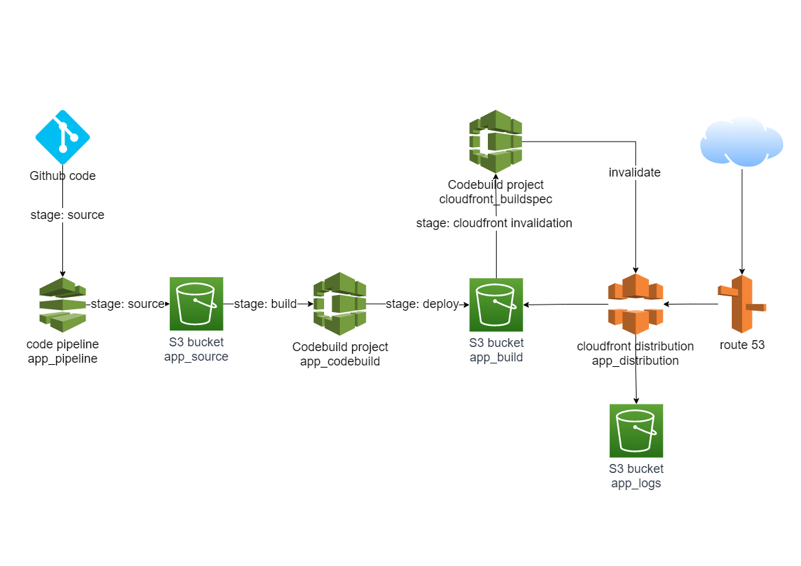

## Deploy Angular app on S3

## Stack

Issue | Technology
------------ | -------------
Git Manager | [Github](https://github.com) 
Infrastructure Provisioning | [Terraform](https://www.terraform.io) - Hashicorp IaC Multicloud Manager
Pipeline / Build Platform | [CodePipeline](https://aws.amazon.com/pt/codepipeline/) + [CodeBuild](https://aws.amazon.com/pt/codebuild/) from AWS
Hosting System | [Amazon S3](https://aws.amazon.com/pt/s3/) -  Low Cost Object Storage with Website feature on AWS
Caching / CDN System | [Amazon Cloudfront](https://aws.amazon.com/pt/cloudfront/) - AWS Global Content Delivery Network 
DNS | [Amazon Route 53](https://aws.amazon.com/ru/route53/) - is a scalable and highly available Domain Name System service.

## Architecture




## Project Configuration

Create the `terraform.tfvars` file and fill required variables.

Example:

```hcl
aws_region            = "us-west-2"
app_name              = "your_app_name"
dist_dir              = "dist/app_name"
env                   = "develop"
git_repository_owner  = "owner_name"
git_repository_name   = "repo_name"
git_repository_branch = "master"
github_token          = "12345678901234567890"
app_domain            = "app.domain.name"
manual_approve        = true
```

## Edit your build specs

You can edit your build specs in modules/website/templates/buildspec.yml 

## Validate and Deploy

* Initialize Terraform

```bash
terraform init
```

* Plan

```bash
terraform plan -out out.tfplan
```

* Apply the changes on AWS

```bash
terraform apply out.tfplan
```
